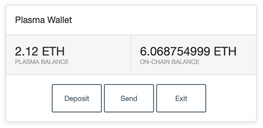
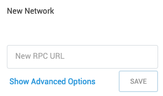

# plasma-metamask-demo

This repository shows you how to build a browser-based Plasma wallet using React, TypeScript, and Web3. It looks like this:



It uses MetaMask to manage signing and on-chain deposits, and the Plasma root node's REST API to send Plasma transactions.

## Where To Start

First, you'll need to run a local Plasma node. We recommend following the instructions on our [documentation site](https://plasma.kyokan.io) to get up and running here. If you build `plasma-harness`, running `plasma-harness` start will automatically start Ganache and migrate the smart contract.

Next, you'll need to configure MetaMask to point to Ganache. You can do this by navigating to MetaMasks settings, and scrolling down until you see 'New Network':



Enter `http://localhost:8545` (or whatever your Ganache RPC url is), and click 'Save.' Then, with your local node running and pointing to Ganache, run the following command:

```bash
$ npm run dev
```

to start webpack-dev-server and serve the wallet at [http://localhost:8080](http://localhost:8080). Your on-chain balance represents the amount of ETH in your MetaMask wallet for the selected account; your Plasma balance represents the amount you've deposited or received on the Plasma chain less the amount you've sent.


## Supported Features

This wallet supports depositing funds into the Plasma contract, sending funds on the Plasma sidechain, and performing exits. It isn't 100% production ready since error handling and other such features that you'd want in a prod-ready wallet are left as exercises for the reader.

## A Note on Exits

When you originate an exit from this wallet, an on-chain transaction that exits one of your outputs as well as a bond are broadcast on chain. The bond is by default equal to the amount of the exit plus 1 million wei. After the challenge period has expired, if nobody has challenged your exit you can call `finalize()` on the smart contract and receive both the value of your exit plus your bond in return. The challenge period is currently set to one week. Future iterations of the smart contract may include shorter challenge periods.